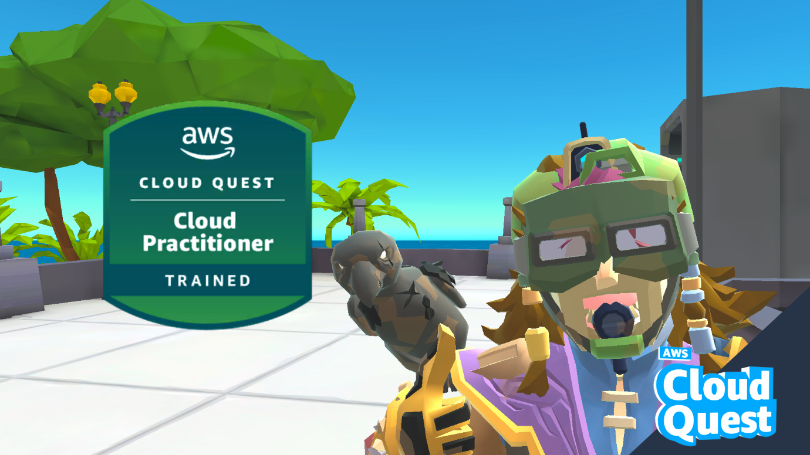

# AWS Cloud Quest — Field Notes

Hands-on notes from **AWS Cloud Quest: Cloud Practitioner**, a gamified, hands-on learning track on AWS Skill Builder. Each assignment dropped me into a live AWS sandbox with a client scenario to solve — this repo is my own write-up of what I built, what broke, and what actually stuck.

**Badge (verified):** [Credly](https://www.credly.com/badges/a729a6fa-0d81-4c94-aacf-001560e0978d/public_url)

## Certificates

| Certificate                                      | Issuer            | File                                                   |
| ------------------------------------------------ | ----------------- | ------------------------------------------------------ |
| AWS Cloud Practitioner Essentials                | AWS Skill Builder | [view](certificates/cloud-practitioner-essentials.pdf) |
| AWS Cloud Quest: Cloud Practitioner — Completion | AWS Skill Builder | [view](certificates/cloud-quest-completion.pdf)        |

---

## Why this exists

A completion badge shows I finished the course. This repo is meant to show the difference — that I understood _why_ each service was the right tool for each scenario, including the parts that didn't work the first time.

---

## Assignments

| #   | Assignment                            | Services                                | Notes                                                                      |
| --- | ------------------------------------- | --------------------------------------- | -------------------------------------------------------------------------- |
| 01  | Static Website Hosting                | S3                                      | [notes](cloud-practitioner/01-static-website-hosting/notes.md)             |
| 02  | Cloud First Steps                     | EC2                                     | [notes](cloud-practitioner/02-ec2-first-launch/notes.md)                   |
| 03  | Computing Solutions                   | EC2, Systems Manager, CLI               | [notes](cloud-practitioner/03-ec2-instance-types/notes.md)                 |
| 04  | Networking Concepts                   | EC2, VPC                                | [notes](cloud-practitioner/04-vpc-networking-concepts/notes.md)            |
| 05  | Cloud Economics                       | AWS Pricing Calculator                  | [notes](cloud-practitioner/05-cost-estimation-pricing-calculator/notes.md) |
| 06  | Databases in Practice                 | RDS, Read Replica, DMS                  | [notes](cloud-practitioner/06-rds-databases-in-practice/notes.md)          |
| 07  | Connecting VPCs                       | VPC Peering                             | [notes](cloud-practitioner/07-vpc-peering/notes.md)                        |
| 08  | First NoSQL Database                  | DynamoDB                                | [notes](cloud-practitioner/08-dynamodb-nosql/notes.md)                     |
| 09  | File Systems in the Cloud             | EFS, EC2, Session Manager               | [notes](cloud-practitioner/09-efs-file-systems/notes.md)                   |
| 10  | Core Security Concepts                | IAM                                     | [notes](cloud-practitioner/10-iam-security-concepts/notes.md)              |
| 11  | Auto-Healing and Scaling Applications | EC2 Auto Scaling                        | [notes](cloud-practitioner/11-ec2-autoscaling/notes.md)                    |
| 12  | Highly Available Web Applications     | ALB, Auto Scaling, Route 53, CloudFront | [notes](cloud-practitioner/12-load-balancing-high-availability/notes.md)   |

---

## Related

- 📄 First article: https://builder.aws.com/content/3JULJx1lORKbl1q1Qj1D6kfF5Fw/i-havent-deployed-anything-on-aws-yet-heres-what-im-doing-instead-and-why
- 🧠 [AWS Cloud Practitioner revision reference](https://claude.ai/artifact/TMSxbarMNpZ6GHev4WLcH8) — concepts, services, and a flashcard deck I built while studying
- 🎓 Also completed: AWS Cloud Practitioner Essentials (AWS Skill Builder)

---

## What's next

Currently working through **AWS Cloud Quest: Solutions Architect** — new notes will land in a `solutions-architect/` folder as I go.
