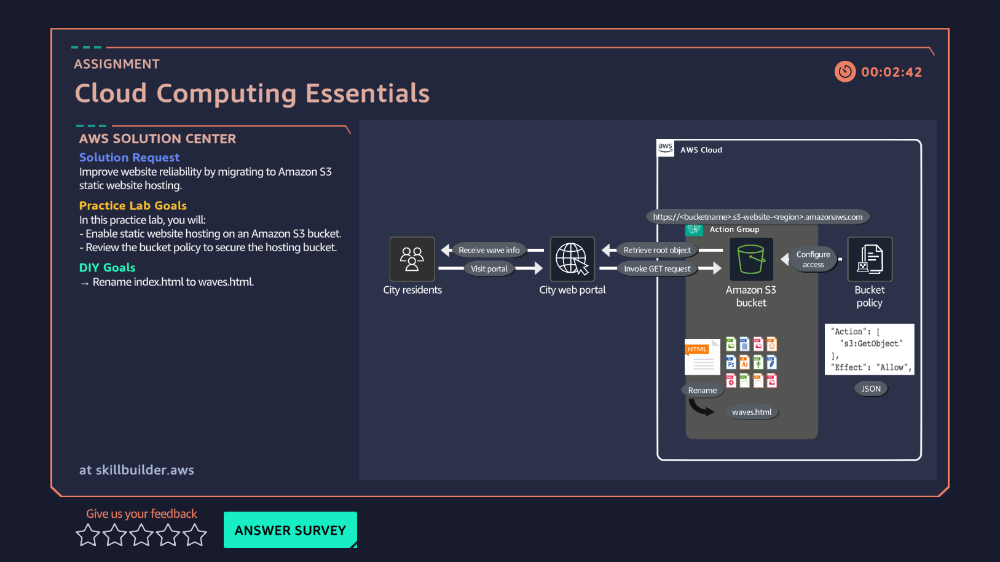

# 01 · Static Website Hosting

**AWS service:** S3

## Scenario

A client needs a static website hosted, with no server to manage.

## What I built

Created an S3 bucket, uploaded website files, and enabled **static website hosting** under the bucket's Properties tab — set the index document (`index.html`) and an error document (`error.html`).

## What I learned

- S3 can serve a website directly — no EC2 or web server needed for static content.
- Enabling static hosting gives a **website endpoint URL** you can open in a browser to see the live page.
- The index/error document settings live under **Properties → Static website hosting**, easy to miss the first time.

## Redo — same lab, second time

Went back and redid this lab from scratch. **First attempt: ~1 hour.** This time: **~2 minutes.**

That gap is the whole point of writing these notes down. First time through, I had nothing to orient against — didn't know where to look, what a "bucket" even implied, or what static hosting meant in practice. I also missed that the lab had a **built-in countdown before auto-termination**, and let the session run out without properly ending it.

Second time, none of that friction existed. I knew exactly which service, which tab, which two settings to set — because I'd already built the mental model once.

**Takeaway:** the redo is worth more than the first attempt looked like it was. Speed on a repeat isn't about memorizing steps — it's proof the underlying concept (S3 buckets serve files, static hosting just exposes them at a URL) actually stuck. Redoing early labs as concepts pile up is a genuinely good habit, not wasted time.
