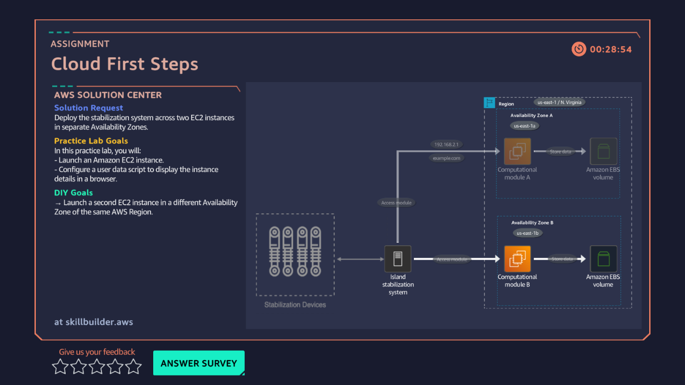

# 02 · First EC2 Launch — Cloud First Steps

**AWS services:** EC2

## Scenario
A client wants their server set up so a single failure doesn't take the system down.

## What I built
Launched two EC2 instances in the **same region but different Availability Zones**, with a user data script that displays instance details in the browser.

## What broke / what I learned
- First attempt: tried creating a new security group with the same name as an existing one — failed. Used the existing security group for the second instance instead.
- **Always end the session / terminate instances after a lab.** This is the habit that matters most going forward — it's what will keep me from getting billed on my own AWS account later.
