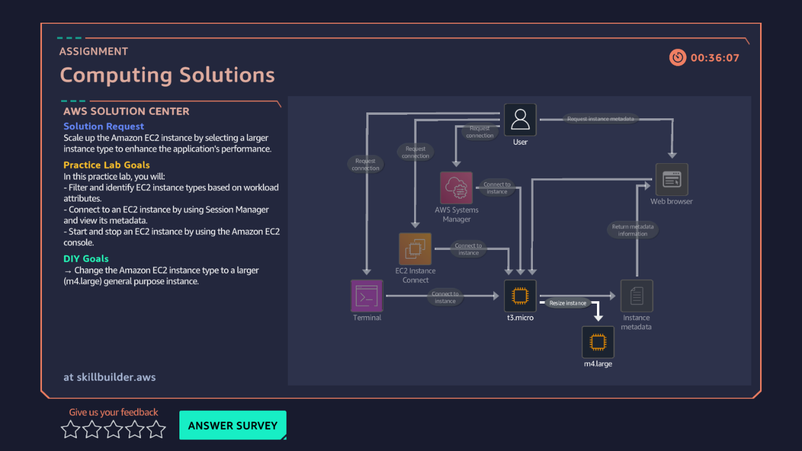

# 03 · EC2 Instance Types — Computing Solutions

**AWS services:** EC2, AWS Systems Manager, AWS CLI

## Scenario
A client wants a scalable system that connects to AWS Systems Manager via scripting.

## What I built
Selected and resized an EC2 instance type: stopped the running instance, changed the instance type, then connected via **Session Manager → CLI**, using `cd` into the log directory and `tail -f name.log` to confirm the change.

## What I learned
- You **must stop** an instance before changing its type — can't resize a running one.
- The instance is confirmed stopped when its **public IPv4 and public DNS disappear** from the console — that's the visual cue to wait for.
