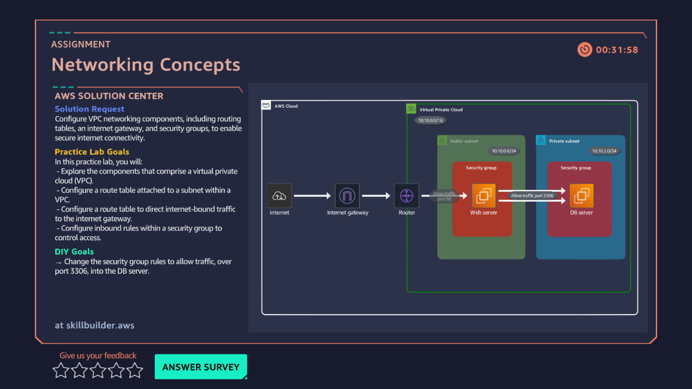

# 04 · VPC Networking Concepts

**AWS services:** EC2, VPC (security groups, route tables)

## Scenario
A client needs a secure connection for their banking server — requires configuring VPC route tables and security groups between two servers.

## What I built
Two EC2 instances, each with its own security group. Defined **inbound and outbound rules** on each security group so the two servers could communicate with each other.

## What I learned
- The core concept: every connection needs a rule on **both sides** — inbound on the receiving security group, outbound on the sending one.
- Understood the idea conceptually before this lab, but doing it hands-on made it click properly.
