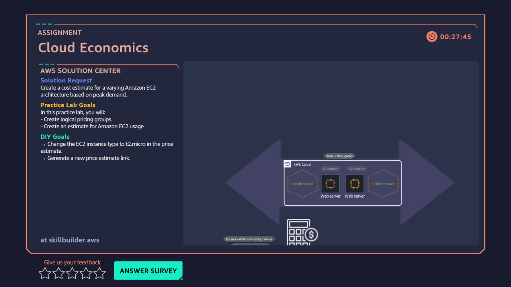

# 05 · Cost Estimation — Cloud Economics

**AWS services:** AWS Pricing Calculator

## Scenario
A client needs a cost estimate for servers whose computation load varies by day, night, and week.

## What I built
Built a cost estimate in the **AWS Pricing Calculator**, entering parameters for varying EC2 usage patterns to compare configurations.

## What I learned
- How to actually model a cost estimate instead of just reading about on-demand vs. reserved pricing in theory.
- The calculator is where "cost optimization" from the Well-Architected Framework becomes a concrete, checkable number instead of a buzzword.
