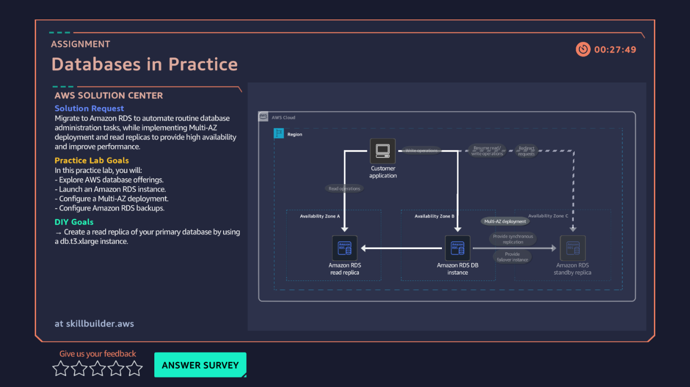

# 06 · Databases in Practice

**AWS services:** Amazon RDS, RDS Read Replica, AWS DMS

## Scenario
A client manages data manually — patching servers and managing users by hand — and needs to migrate to AWS without downtime for analysis workloads.

## What I built
Created an RDS instance, added a **read replica**, and connected it via **AWS Database Migration Service (DMS)** for the migration path.

## What I learned
- Creating a database or its replica isn't instant — expect to **wait 5–10 minutes** for it to come online. Good reminder to plan around that in real deployments, not just labs.
