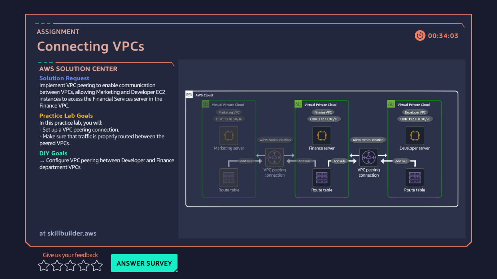

# 07 · Connecting VPCs — VPC Peering

**AWS services:** EC2, VPC, VPC Peering

## Scenario
A client wants separate VPCs per department (marketing, developer, finance) but still needs private communication between them.

## What I built
Set up **VPC peering connections** between each department's VPC, using private IPv4 addresses from each subnet and adding routes for source-to-destination traffic — configured on **both sides** of each peered connection.

## What I learned
- Peering isn't automatic once connected — each VPC's **route table** needs an explicit route pointing to the peering connection, on both ends.
- This is the same "both sides need a rule" pattern from the security groups lab, just one layer up at the routing level.
