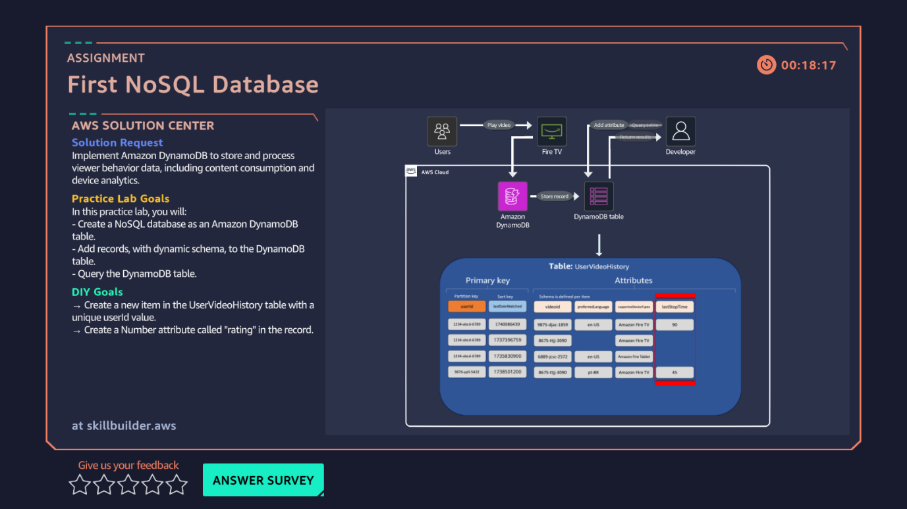

# 08 · First NoSQL Database — DynamoDB

**AWS services:** Amazon DynamoDB

## Scenario
A client needs a dynamic database that can be queried with low latency.

## What I built
Created a DynamoDB table with a **partition key** and additional attribute keys of different types.

## What I learned
- The practical difference between a **scan** (reads the whole table) and a **query** (uses the key schema to fetch specific items) — and why query is the one you actually want for low-latency lookups at scale.
