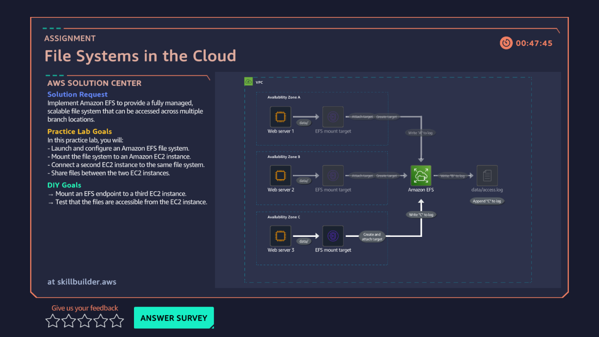

# 09 · File Systems in the Cloud — EFS

**AWS services:** Amazon EFS, Amazon EC2, AWS Systems Manager (Session Manager)

## Scenario
A client needs compute servers (EC2) to share a common, scalable file system with low-latency access.

## What I built
Set up EC2 instances across different Availability Zones on a shared security group, connected to each via **Session Manager**, installed the required packages, and mounted each instance to the EFS file system using Linux commands.

## What broke / what I learned
- Second web server didn't mount properly on the first attempt — root cause wasn't fully clear at the time, since I hadn't learned the underlying Linux commands from scratch yet (was working from CLI familiarity rather than deep knowledge).
- Reconnected manually through the guided steps to fix it, then repeated the mount successfully during the DIY challenge.
- **Takeaway:** this is the lab that flagged Linux fundamentals as a gap worth closing properly, not just working around.
