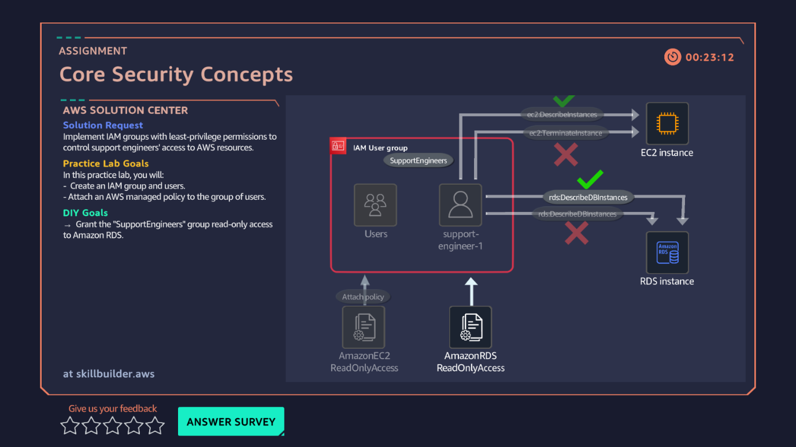

# 10 · Core Security Concepts — IAM

**AWS services:** IAM

## Scenario
A client wants a specific user group given read-only permissions — nothing more.

## What I built
Created an IAM user group and a user with a password, then attached specific managed policies: **EC2 ReadOnlyAccess** and **RDS ReadOnlyAccess**.

## What I learned
- How to actually grant scoped permissions instead of defaulting to broad access.
- Permissions aren't fixed after attaching a policy — they can be **edited later** as needs change, which matters for least-privilege access over time.
