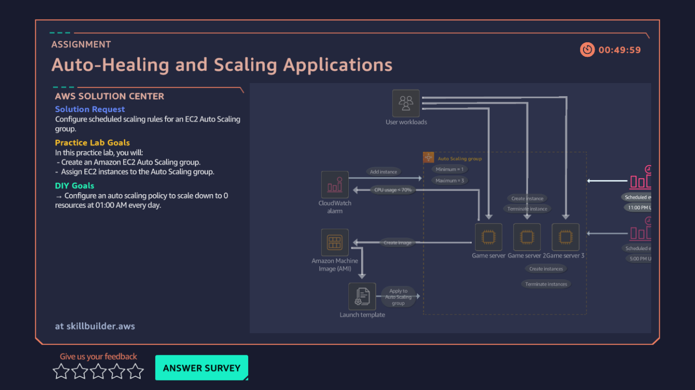

# 11 · Auto-Healing and Scaling Applications

**AWS services:** EC2 Auto Scaling, Launch Templates

## Scenario
A gaming platform client wants servers to scale automatically with demand, and to stop during low-usage periods to control cost.

## What I built
Configured an **Auto Scaling group** with a launch template and scaling policy.

## What I learned
Was confused going in, but came out with a clear distinction between the two scaling mechanisms:

| Type | How it works | Trigger |
|---|---|---|
| **Dynamic Scaling Policy** | Adjusts capacity based on live metrics (CPU, requests, etc.) | Reactive — metric-based |
| **Scheduled Action** | Changes capacity at a specific time | Proactive — time-based |

Knowing *when to use which* was the actual lesson — not just that both exist.
