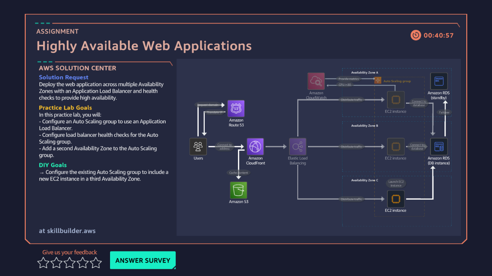

# 12 · Highly Available Web Applications — Load Balancing

**AWS services:** EC2 Auto Scaling, Elastic Load Balancing (ALB), Route 53, CloudFront

## Scenario
A client wants to reduce load on their web server and have its health checked regularly.

## What I built
Deployed a web application across EC2 instances spanning multiple Availability Zones, sitting behind a **load balancer**. Configured health checks on the load balancer, hooked it into the Auto Scaling group, and added a second Availability Zone to the group.

## What I learned
How load balancing and auto scaling work **together**, not as separate concepts:
- The load balancer distributes traffic and drops instances that fail health checks.
- The Auto Scaling group keeps enough healthy instances running across AZs to keep the app available.

This was the lab that tied the whole practitioner track together — VPC, EC2, scaling, and health checks all showing up in one architecture.
